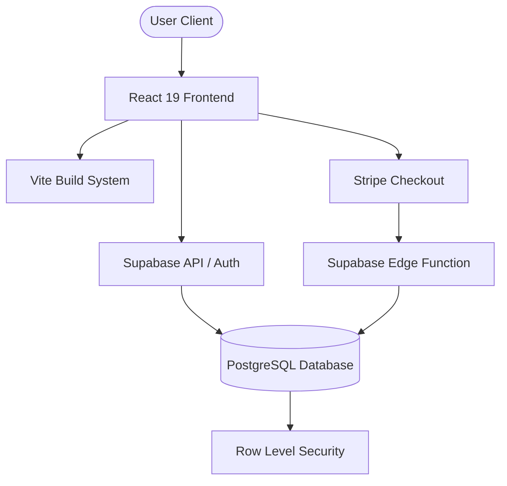

# 🏎️ AutoSphere: The Pinnacle of Automotive Digital Experience

[](https://react.dev/)
[](https://www.typescriptlang.org/)
[](https://vitejs.dev/)
[](https://supabase.com/)
[](https://stripe.com/)
[](https://opensource.org/licenses/MIT)

AutoSphere is a premium, high-performance automotive collection platform designed for the most exclusive vehicle catalogs. Engineered with a "Skills-First" methodology, it demonstrates absolute compliance with modern web standards, accessibility (WCAG 2.1), and programmatic SEO.

---

## 💎 Project Pillars

### 🚀 Performance Excellence
- **LCP Optimization**: Strategic use of `fetchPriority="high"` and centered hero layouts for maximum visual impact without layout shift.
- **Smart Loading**: `ImageWithSkeleton` component ensures smooth transitions and perceived performance.
- **Lazy Execution**: Intersection-observer driven animations and lazy-loaded assets reduce initial load time.

### ♿ Absolute Accessibility
- **WCAG 2.1 Compliant**: Full keyboard navigation support (tested via `SkipLink`).
- **ARIA Landmarked**: Semantically structured landmark headers and ARIA label implementation for all interactive elements.
- **Contrast & Motion**: Respects `prefers-reduced-motion` and features a high-contrast dark-mode palette.

### 🌐 Programmatic SEO
- **Centralized Metadata**: Custom `SEO` management component for dynamic page titles and meta descriptions.
- **Dynamic Routing**: Deep search parameter integration (`?condition`, `?type`) enables shared, bookmarkable filter states.

### 🛡️ Secure Backend & Payments
- **Supabase Integration**: Robust PostgreSQL backend with Row Level Security (RLS) and Edge Functions.
- **Stripe Checkout**: End-to-end reservation flow using Stripe Checkout Sessions and secure webhook verification.
- **Structured Logging**: Wide-event logging in edge functions for enterpirse-grade observability.

---

## 🛠️ Architecture



---

## ⚙️ Setup & Installation

### Prerequisites
- Node.js 18+
- Supabase CLI (for local migrations)
- Stripe Account (for API keys)

### Installation
1. Clone the repository:
   ```bash
   git clone https://github.com/your-username/autosphere.git
   cd autosphere
   ```

2. Install dependencies:
   ```bash
   npm install
   ```

3. Configure Environment:
   ```bash
   cp .env.example .env.local
   # Fill in your Supabase & Stripe Publishable keys
   ```

4. Launch Development:
   ```bash
   npm run dev
   ```

---

## 📦 Deployment

### Vercel (Frontend)
The project is optimized for Vercel deployment with specialized `vercel.json` configurations for SPA rewrites and performance headers.

### Supabase (Backend)
Deploy database migrations and edge functions:
```bash
# Push migrations
supabase db push

# Deploy stripe-webhook function
supabase functions deploy stripe-webhook
```

---

## 📜 License
This project is licensed under the MIT License - see the [LICENSE](LICENSE) file for details.

Developed with ❤️ for the world's most discerning drivers.
